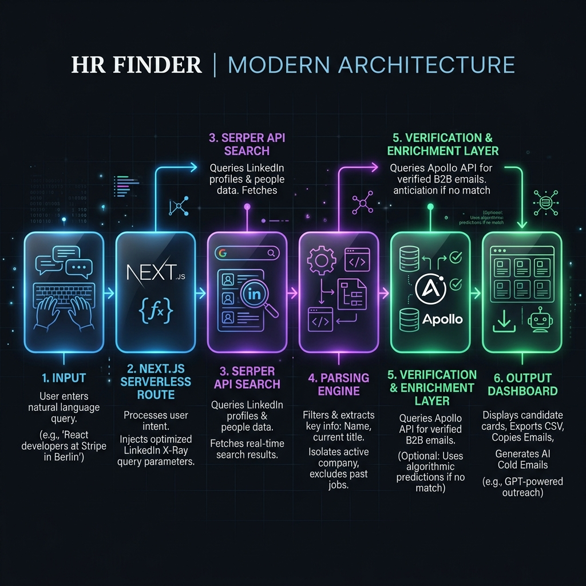

# HR Finder / Recruiter & Talent Scout Radar 📡

[](https://hr-search.vercel.app/)

A modern, serverless web application built with **Next.js 14 (App Router)** designed to perform targeted OSINT-focused lookups for talent acquisition teams, hiring managers, and HR personnel. It automates lead generation by querying search indexes securely, predicting corporate email addresses, and drafting hyper-targeted outreach emails on the fly.



---

## 🚀 Key Features

*   **Next.js 14 Serverless Architecture**: Fast, lightweight, and fully optimized for Vercel deployment with secure API routes.
*   **Security-First Proxying**: Serper API credentials are kept safe via server-side environmental variables (`SERPER_API_KEY`) or client-side `localStorage` configuration.
*   **Streamlined Search Engine**: A simple, powerful hero search bar accepts natural language queries (e.g. `"HR at JP Morgan Hyderabad"`, `"Recruiter at Stripe London"`) without needing complex form settings.
*   **Fuzzy Verification Framework**: Dynamic backend algorithms predict corporate email domains and format permutations, validation checks automatically filter out broken and placeholder patterns.
*   **Checklist Scanning Terminal**: Real-time checklist loader and terminal output stream detailing search parameters, query depth, and parsed payload indices.
*   **AI Cold Email Generator**: Interactive sidebar modal allows users to select context templates (Job Application, Networking, or Follow-up) and dynamically weaves the contact's name, company, and search snippet details into a personalized pitch draft.
*   **Sticky Data Exports Panel**: A frosted-glass floating control center to copy all emails to the clipboard or export results to a clean CSV file in one click.
*   **Session Persistence**: Search results accumulate and append dynamically in the current session while filtering out duplicates.

---

## 🛠️ Tech Stack

*   **Frontend**: React, Next.js 14 (App Router), CSS Variables (Tailwind-like dark/light theme management).
*   **Backend**: Next.js Serverless Route Handlers, Serper API integration.
*   **Icons**: Tabler Icons (`@tabler/icons-web` via CDN).

---

## 📦 Getting Started

### Prerequisites

*   Node.js (v18.x or later)
*   A free or paid **Serper API Key** (get one at [serper.dev](https://serper.dev) - 2,500 searches free).

### Installation & Setup

1.  **Clone the Repository**:
    ```bash
    git clone https://github.com/varadrz/HR-Search.git
    cd HR-Search
    ```

2.  **Install Dependencies**:
    ```bash
    npm install
    ```

3.  **Environment Configuration**:
    Create a `.env` file in the root directory:
    ```env
    # Serper API credentials (optional if using client-side key storage)
    SERPER_API_KEY=your_serper_api_key_here
    ```

4.  **Run Local Development Server**:
    ```bash
    npm run dev
    ```
    Open [http://localhost:3000](http://localhost:3000) in your browser.

5.  **Build for Production**:
    ```bash
    npm run build
    npm run start
    ```

---

## 🛡️ License

This project is dual-licensed under the **MIT License** and the **HR Finder Custom License Supplement**. See the `LICENSE` and `LICENSE-CUSTOM` files for more details.
